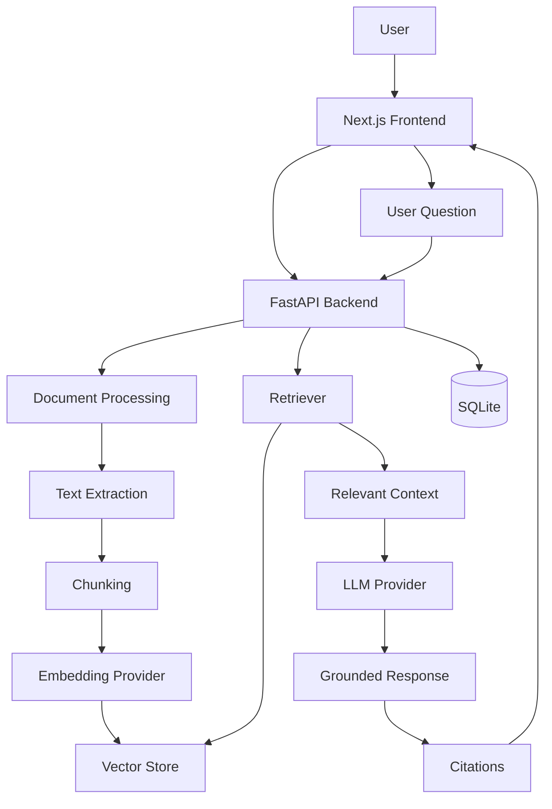

# IntelliDocs — AI Document Intelligence & RAG Assistant

> **Ask questions about your documents. Get grounded answers with sources.**

IntelliDocs is a **Retrieval-Augmented Generation (RAG)** web application that transforms uploaded PDFs, Word documents, and text files into an AI-powered knowledge base.

Instead of sending an entire document to an LLM, IntelliDocs extracts the content, splits it into meaningful chunks, creates embeddings, retrieves the most relevant information, and provides the retrieved context to an LLM to generate a **grounded, cited response**.

The project demonstrates how modern GenAI applications can be built beyond a simple chatbot or file-upload interface.

---

## ✨ Why IntelliDocs?

Searching through large collections of documents can be slow and unreliable.

Traditional keyword search can miss questions that use different wording, while sending entire documents to an LLM can be expensive, inefficient, and increase the risk of hallucinations.

IntelliDocs solves this using **RAG**:

```text
Upload Document
      ↓
Extract Text
      ↓
Chunk Document
      ↓
Generate Embeddings
      ↓
Store Vectors
      ↓
User Question
      ↓
Retrieve Relevant Chunks
      ↓
LLM + Retrieved Context
      ↓
Grounded Answer + Citations
```

The LLM receives **only the relevant retrieved content**, rather than the entire original document.

---

# 🚀 Features

### 📄 Document Intelligence

* Upload PDF, DOCX, TXT, and Markdown files
* Drag-and-drop document upload
* Automatic text extraction
* Document chunking with configurable overlap
* Processing status and metadata
* Document deletion
* Chunk count and document statistics

### 💬 RAG-powered Q&A

* Ask questions using natural language
* Semantic retrieval from uploaded documents
* Top-k relevant chunk retrieval
* Grounded LLM responses
* Unsupported-question refusal
* Streaming responses when supported by the LLM provider

### 🔎 Source Citations

Every retrieved source can include:

* Document filename
* Page or section
* Text excerpt
* Similarity score
* Source number referenced in the answer

This makes AI responses easier to verify and helps reduce unsupported claims.

### 📊 Document Analysis

* Executive document summaries
* Side-by-side document comparison
* Similarity and difference detection
* Contradiction identification
* Structured insight extraction
* People, organizations, dates, risks, and other entities
* AI-generated action items
* Priority-based action items

### 🔍 Semantic Search

Search the entire knowledge base using meaning rather than exact keyword matches.

For example:

```text
"What is the company's vacation policy?"
```

can retrieve content containing:

```text
"Employees are entitled to 20 days of annual leave..."
```

even though the wording is different.

### 🎨 Modern Web Interface

* Next.js frontend
* Responsive UI
* Light and dark themes
* Dashboard
* Document management
* AI chat interface
* Source/citation display
* Document comparison interface

---

# 🧠 RAG Architecture



---

# 🔄 How the RAG Pipeline Works

## 1. Document ingestion

A user uploads a document.

Supported formats:

```text
PDF
DOCX
TXT
Markdown
```

The backend validates the file, sanitizes its filename, stores it safely, and extracts its text.

---

## 2. Chunking

Large documents are divided into smaller overlapping chunks.

Default configuration:

```text
Chunk size:     900 characters
Overlap:        150 characters
Top-K retrieval: 5 chunks
```

Metadata is preserved with each chunk:

```text
document ID
filename
page / section
chunk index
```

This allows retrieved content to be traced back to its original source.

---

## 3. Embeddings

Each chunk can be converted into an embedding vector.

IntelliDocs uses an abstraction layer:

```text
EmbeddingProvider
       │
       ├── MockEmbeddingProvider
       │
       └── APIEmbeddingProvider
```

The mock provider is used for development and testing without downloading large ML models.

The API provider supports OpenAI-compatible embedding endpoints for production use.

---

## 4. Vector storage

Embeddings are stored using a pluggable vector-store architecture:

```text
VectorStore
     │
     ├── LocalVectorStore
     │
     └── ChromaVectorStore
```

The default implementation is a lightweight local vector store using cosine similarity and JSON persistence.

ChromaDB can be enabled when required.

---

## 5. Retrieval

When a user asks a question:

```text
Question
   ↓
Question embedding
   ↓
Vector similarity search
   ↓
Top-K relevant chunks
```

The most relevant chunks are selected and passed to the generation layer.

---

## 6. Generation

The retrieved context is provided to the LLM with instructions to answer using the supplied information.

Conceptually:

```text
System Instructions
        +
Retrieved Context
        +
User Question
        ↓
       LLM
        ↓
Grounded Answer
```

If the retrieved context cannot support the question, IntelliDocs returns a refusal instead of allowing the model to invent an answer.

---

## 7. Citations

Retrieved chunks are numbered and included in the generation context.

The response can reference sources such as:

```text
[1] Product Technical Specification — Section 3
[2] Employee Handbook — Page 14
```

The UI exposes the corresponding excerpts and similarity information.

---

# 🛠️ Tech Stack

| Layer               | Technology                               |
| ------------------- | ---------------------------------------- |
| Frontend            | Next.js, React, TypeScript, Tailwind CSS |
| Backend             | Python, FastAPI, Pydantic, SQLAlchemy    |
| Database            | SQLite                                   |
| Vector Store        | LocalVectorStore / ChromaDB              |
| Embeddings          | Mock / OpenAI-compatible API             |
| LLM                 | Groq / OpenAI-compatible API / Mock      |
| Document Processing | pypdf, python-docx                       |
| Testing             | pytest, FastAPI TestClient               |
| Version Control     | Git, GitHub                              |

---

# 📁 Project Structure

```text
intellidocs-ai/
│
├── backend/
│   ├── app/
│   │   ├── embeddings/
│   │   ├── vectorstore/
│   │   ├── ...
│   │   └── main.py
│   │
│   ├── tests/
│   ├── requirements.txt
│   └── .env.example
│
├── frontend/
│   ├── app/
│   ├── components/
│   ├── lib/
│   └── package.json
│
├── data/
│   └── sample_documents/
│
├── docs/
│   └── screenshots/
│
├── eval/
│   └── evaluate.py
│
├── INTERVIEW.md
├── README.md
├── docker-compose.yml
└── .gitignore
```

---

# ⚙️ Getting Started

## Prerequisites

Install:

* Python 3.11+
* Node.js 20+
* npm

A Groq or OpenAI API key is required for live LLM generation.

The application can also run in mock mode without API keys.

---

## 1. Clone the repository

```bash
git clone https://github.com/Bhumika-Raut/Intellidoc.git
cd Intellidoc
```

---

## 2. Configure environment variables

Create a `.env` file from the example:

### Windows

```powershell
copy .env.example .env
```

### macOS / Linux

```bash
cp .env.example .env
```

For a zero-configuration development setup:

```env
LLM_PROVIDER=mock
EMBEDDING_PROVIDER=mock
VECTOR_STORE=local
```

For Groq:

```env
LLM_PROVIDER=groq
GROQ_API_KEY=your_api_key
LLM_MODEL=llama-3.1-8b-instant
```

For OpenAI:

```env
LLM_PROVIDER=openai
OPENAI_API_KEY=your_api_key
LLM_MODEL=gpt-4o-mini
```

**Never commit API keys or `.env` files to GitHub.**

---

# ▶️ Running the Backend

From the repository root:

```bash
cd backend
```

Create a virtual environment:

### Windows

```powershell
python -m venv .venv
.venv\Scripts\activate
```

### macOS / Linux

```bash
python -m venv .venv
source .venv/bin/activate
```

Install dependencies:

```bash
pip install -r requirements.txt
```

Start the API:

```bash
uvicorn app.main:app --reload --port 8000
```

Backend:

```text
http://localhost:8000
```

Swagger API documentation:

```text
http://localhost:8000/docs
```

---

# ▶️ Running the Frontend

Open another terminal:

```bash
cd frontend
npm install
npm run dev
```

Open:

```text
http://localhost:3000
```

---

# 🧪 Running Tests

From the repository root:

```bash
cd backend
pytest
```

The test suite covers areas including:

* Document processing
* Document CRUD
* RAG workflow
* Embedding providers
* Vector-store operations
* Retrieval
* Error handling
* Empty vector stores
* Persistence

The tests can run using the mock providers without downloading large ML models or requiring paid APIs.

---

# 📡 API

The backend exposes REST APIs through FastAPI.

Important endpoints include:

```text
POST   /api/documents/upload
GET    /api/documents
POST   /api/chat
POST   /api/chat/stream
POST   /api/search
POST   /api/documents/compare
POST   /api/documents/{id}/summarize
POST   /api/documents/{id}/extract-insights
POST   /api/documents/{id}/action-items
```

Interactive API documentation:

```text
http://localhost:8000/docs
```

---

# 🔐 Security Considerations

IntelliDocs follows several basic security practices:

* API keys remain on the backend
* API secrets are never exposed to the browser
* Upload extensions are allowlisted
* Upload size is restricted
* Filenames are sanitized
* Path traversal is prevented
* Uploaded files are never executed
* CORS is restricted to configured origins
* API errors avoid exposing internal stack traces

The application is designed as a portfolio project and would require additional security and infrastructure work before handling sensitive production data.

---

# 📈 Evaluation

The project includes an evaluation structure for measuring:

* Retrieval hit rate
* Answer relevance
* Citation presence
* Unsupported-question refusal

The system can be evaluated with mock providers for deterministic testing and configured with a real LLM provider for live evaluation.

---

# 🖥️ Demo Flow

A typical demonstration looks like this:

### 1. Upload a document

Upload:

```text
product_technical_specification.md
```

### 2. Wait for processing

The document is:

```text
Extracted
   ↓
Chunked
   ↓
Embedded
   ↓
Indexed
```

### 3. Ask a question

Example:

> What authentication mechanism does the product use?

### 4. Receive a grounded response

The system retrieves the relevant section and generates an answer.

### 5. Verify the sources

Open the **Sources** section to see:

```text
Filename
Page / Section
Excerpt
Similarity Score
```

### 6. Explore other AI features

You can also demonstrate:

* Executive Summary
* Semantic Search
* Document Comparison
* Insight Extraction
* Action Items

---

# 📚 Sample Documents

The repository includes original sample documents for demonstrating the application:

```text
data/sample_documents/
├── software_project_requirements.md
├── employee_handbook.md
├── product_technical_specification.md
└── product_technical_specification_v2.md
```

The two technical specification versions can be used to demonstrate document comparison.

---

# 🎯 What This Project Demonstrates

IntelliDocs was designed to demonstrate practical GenAI engineering concepts rather than simply wrapping an LLM API in a chat interface.

### GenAI

* Retrieval-Augmented Generation
* Embeddings
* Vector search
* Prompt engineering
* Grounded generation
* Hallucination mitigation
* Source attribution
* Structured LLM outputs

### Backend Engineering

* FastAPI
* REST API design
* SQLAlchemy
* Provider abstraction
* Modular architecture
* Error handling
* Automated testing

### Frontend Engineering

* Next.js
* React
* TypeScript
* Responsive UI
* Streaming interfaces
* API integration

---

# 🔮 Future Improvements

Potential production-oriented improvements include:

* PostgreSQL
* Multi-user authentication
* Tenant isolation
* Hybrid BM25 + vector search
* Cross-encoder reranking
* OCR for scanned documents
* Multimodal document processing
* Background workers using Celery or RQ
* Persistent caching
* Improved evaluation datasets
* Encryption at rest
* Cloud object storage

---

# 👩‍💻 Author

**Bhumika Prakash Raut**

B.Tech Computer Science Engineering
MIT ADT University, Pune

**GitHub:**
https://github.com/Bhumika-Raut

**LinkedIn:**
https://linkedin.com/in/bhumika-raut-10b078295

---

## ⭐ Project Highlight

**IntelliDocs is a portfolio project demonstrating an end-to-end RAG architecture — from document ingestion and chunking to embeddings, vector retrieval, grounded LLM generation, and source attribution.**
