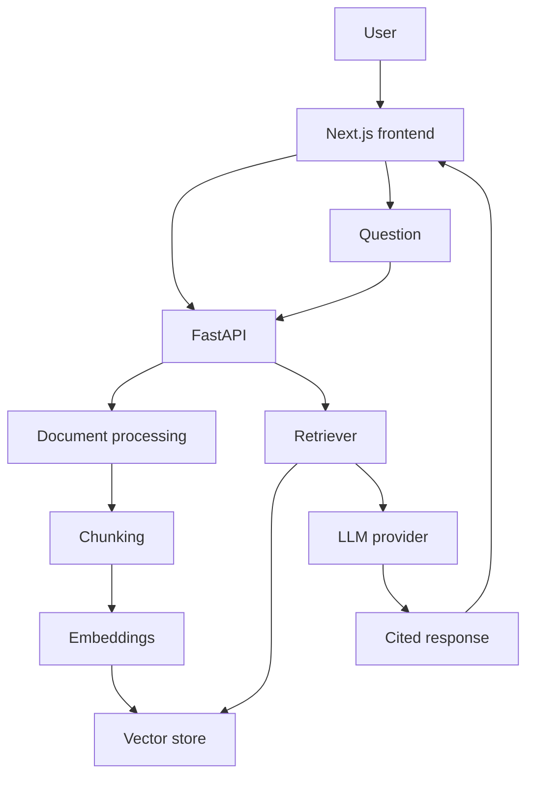

# IntelliDocs

IntelliDocs is a retrieval-augmented generation (RAG) web app that turns uploaded PDFs, Word files, and text into a cited knowledge base. You ask questions in natural language; the system retrieves relevant chunks from the vector store, then an LLM answers **only** from that context.

This is a portfolio-grade implementation of how production LLM applications are actually built: ingestion, chunking, embeddings, vector search, prompt templates, structured outputs, and source attribution — not a ChatGPT clone with a file picker.

## Problem

Searching a folder of requirements, handbooks, and specs is slow and unreliable. Keyword search misses paraphrases. Dropping an entire document into a long-context model is expensive, hits token limits, and still hallucinates. Teams need answers that point back to **which file and page** supported the claim.

## Solution

IntelliDocs implements a classic RAG pipeline:

1. Extract and clean text from each upload.
2. Split into overlapping chunks with metadata (document id, filename, page/section, chunk index).
3. Embed chunks once and store them in the vector store (pluggable: built-in local store by default, ChromaDB optional).
4. Embed each user question and retrieve the top-k similar chunks.
5. Generate an answer from those chunks only, with inline citations.
6. If retrieval cannot support the question, return a fixed refusal sentence.

## Features

- Document upload (drag-and-drop) for PDF, DOCX, TXT, Markdown
- Processing status, metadata, chunk counts, delete
- Semantic Q&A with streaming (when the provider supports it)
- Source citations (filename, page, excerpt, similarity score)
- Executive summaries
- Side-by-side document comparison (similarities, differences, contradictions)
- Structured insight extraction (people, orgs, dates, risks, …)
- Action items with priority and source
- Semantic search across the knowledge base
- Dashboard with documents, chunks, questions, summaries
- Light and dark UI
- Provider abstraction for LLMs and embeddings

## Architecture



SQLite stores documents, conversations, and query logs. Vector embeddings live in the pluggable vector store (default: built-in JSON-persisted cosine store; ChromaDB optional). The LLM never sees the raw file bytes — only retrieved text.

## RAG pipeline

1. **Ingestion** — Validated upload is stored on disk (never executed). Text is extracted with pypdf, python-docx, or UTF-8/latin-1 for text/markdown.
2. **Chunking** — ~900 characters with 150-character overlap, preferring paragraph and sentence boundaries. Page/section metadata is kept on each chunk.
3. **Embeddings** — Provider abstraction: `MockEmbeddingProvider` (deterministic, zero downloads; default for dev/tests) or `APIEmbeddingProvider` (OpenAI-compatible endpoint, for production).
4. **Retrieval** — Query embedding → cosine search in the vector store → top-k (default 5), with a weak-score floor.
5. **Generation** — System prompt requires grounded answers and a fixed refusal if context is insufficient.
6. **Citation** — Each retrieved chunk is numbered `[1]…[n]` in the prompt; the UI lists filename, page, excerpt, and score.

## Tech stack

| Layer | What is actually used |
| --- | --- |
| Frontend | Next.js 14, React 18, TypeScript, Tailwind CSS |
| Backend | Python, FastAPI, Pydantic, SQLAlchemy |
| Database | SQLite (portable to PostgreSQL) |
| Vectors | Built-in `LocalVectorStore` (JSON persistence, cosine) by default; ChromaDB optional via `VECTOR_STORE=chroma` |
| Embeddings | `MockEmbeddingProvider` (default, no downloads) / `APIEmbeddingProvider` (OpenAI-compatible API) — no PyTorch anywhere |
| LLM | OpenAI-compatible API (Groq or OpenAI) plus a `MockProvider` for tests |
| Tests | pytest + FastAPI TestClient |

## Installation

### Prerequisites

- Python 3.11+
- Node.js 20+
- A Groq or OpenAI API key for live generation and, if you set `EMBEDDING_PROVIDER=api`, embeddings. With `LLM_PROVIDER=mock` + `EMBEDDING_PROVIDER=mock` the whole app runs with no keys at all.

### 1. Clone and environment

```bash
cd Gen-ai
copy .env.example .env
```

On macOS/Linux use `cp .env.example .env`.

Edit `.env`:

- For **Groq** (free tier): set `LLM_PROVIDER=groq`, `GROQ_API_KEY=...`, `LLM_MODEL=llama-3.1-8b-instant`
- For **OpenAI**: set `LLM_PROVIDER=openai`, `OPENAI_API_KEY=...`, `LLM_MODEL=gpt-4o-mini`
- Leave `EMBEDDING_PROVIDER=mock` for zero-setup runs; set it to `api` (with `EMBEDDING_API_KEY`) for real semantic retrieval

### 2. Backend

```bash
cd backend
python -m venv .venv
.venv\Scripts\activate
pip install -r requirements.txt
uvicorn app.main:app --reload --host 0.0.0.0 --port 8000
```

Nothing extra to download: mock embeddings and the built-in vector store need no model weights.

### 3. Frontend

```bash
cd frontend
npm install
npm run dev
```

Open [http://localhost:3000](http://localhost:3000). The UI talks to [http://localhost:8000](http://localhost:8000). **No API keys are shipped to the browser.**

## Environment variables

| Variable | Purpose |
| --- | --- |
| `LLM_PROVIDER` | `groq`, `openai`, or `mock` |
| `LLM_MODEL` | Chat model name |
| `GROQ_API_KEY` | Groq key (backend only) |
| `OPENAI_API_KEY` | OpenAI key (backend only) |
| `OPENAI_BASE_URL` | Optional custom OpenAI-compatible base URL |
| `EMBEDDING_PROVIDER` | `mock` (default, offline) or `api` (OpenAI-compatible) |
| `EMBEDDING_MODEL` | Embedding model name used by the API provider (e.g. `text-embedding-3-small`) |
| `EMBEDDING_API_KEY` / `EMBEDDING_API_BASE` | Embeddings API credentials (fall back to `OPENAI_API_KEY` / `OPENAI_BASE_URL`) |
| `DATABASE_URL` | SQLAlchemy URL (SQLite by default) |
| `VECTOR_STORE` | `local` (default, dependency-free) or `chroma` (optional extra) |
| `VECTOR_PATH` | Persistence directory for the local vector store |
| `UPLOAD_DIR` | Stored uploads |
| `MAX_UPLOAD_MB` | Upload size limit |
| `CORS_ORIGINS` | Allowed browser origins |
| `RETRIEVAL_TOP_K` | How many chunks to pass the LLM |
| `CHUNK_SIZE` / `CHUNK_OVERLAP` | Ingestion chunking |
| `NEXT_PUBLIC_API_URL` | Frontend → API origin (not a secret) |

## Running locally

Terminal A (from `backend/`):

```bash
uvicorn app.main:app --reload --port 8000
```

Terminal B (from `frontend/`):

```bash
npm run dev
```

### Docker

From the repository root, with a populated `.env`:

```bash
docker compose up --build
```

Backend image builds are quick: requirements.txt pulls no PyTorch and no model weights.

## API documentation

With the backend running, open:

- Swagger UI: [http://localhost:8000/docs](http://localhost:8000/docs)
- OpenAPI JSON: [http://localhost:8000/openapi.json](http://localhost:8000/openapi.json)

Notable routes: `POST /api/documents/upload`, `GET /api/documents`, `POST /api/chat`, `POST /api/chat/stream`, `POST /api/search`, `POST /api/documents/compare`, `POST /api/documents/{id}/summarize`, `POST /api/documents/{id}/extract-insights`, `POST /api/documents/{id}/action-items`.

## Tests

From the repository root (uses `LLM_PROVIDER=mock` and `EMBEDDING_PROVIDER=mock` — no paid API, no downloads):

```bash
cd backend
pip install -r requirements.txt
cd ..
pytest
```

## Evaluation

```bash
cd backend
set LLM_PROVIDER=mock
python -m eval.evaluate
```

Reports retrieval hit rate, answer relevance, citation presence, and unsupported-question refusal. Point `LLM_PROVIDER` at Groq/OpenAI to score a real model.

## Sample documents

Original demo files (not copied from copyrighted products):

- `data/sample_documents/software_project_requirements.md`
- `data/sample_documents/employee_handbook.md`
- `data/sample_documents/product_technical_specification.md`
- `data/sample_documents/product_technical_specification_v2.md` (for Compare)

## 2-minute demo

1. Open `/dashboard`.
2. Go to **Documents** and upload `product_technical_specification.md`.
3. Wait until status is **Ready** (chunk count &gt; 0).
4. Open **Chat** and ask: *What authentication mechanism does the product use?*
5. Confirm the answer mentions OAuth 2.0 / PKCE.
6. Expand **Sources** — filename, page/section, excerpt, score.
7. Upload `product_technical_specification_v2.md`. Open **Compare**, select v1 and v2, run comparison.
8. Open the document page → **Executive summary**.
9. Open **Insights** → extract insights and generate action items.

## Screenshots

Place captures in `docs/screenshots/` (see the README in that folder). Suggested: dashboard, documents, chat with citations, compare table.

## Security notes

- API keys stay in backend environment variables.
- Uploads are extension-allowlisted, size-capped, and filename-sanitized (no path traversal).
- Files are never executed or passed to a shell.
- CORS is origin-restricted.
- Unhandled exceptions return a generic message — no stack traces in the API JSON.

## Future improvements

- PostgreSQL + multi-user authentication
- Hybrid search (BM25 + vectors) and a cross-encoder reranker
- OCR / multimodal PDFs
- Celery or RQ workers instead of FastAPI BackgroundTasks
- Persistent summary cache and an evaluation harness with labeled gold answers
- Tenant isolation and encryption at rest for uploaded files

## Interview notes

See [INTERVIEW.md](./INTERVIEW.md) for implementation-grounded answers to common GenAI interview questions.

## Resume bullets

- Built IntelliDocs, a Generative AI RAG assistant in Python/FastAPI that chunks PDFs and text, embeds via a swappable provider layer (mock/offline or OpenAI-compatible API), and retrieves context from a pluggable vector store (built-in or ChromaDB) before calling an LLM.
- Implemented cited Q&A, semantic search, document comparison, structured insight extraction, and action-item generation over REST APIs with provider-agnostic LLM and embedding layers.
- Shipped a Next.js/TypeScript SaaS UI (upload pipeline, streaming chat, light/dark mode) backed by SQLite metadata and production-minded upload validation.
